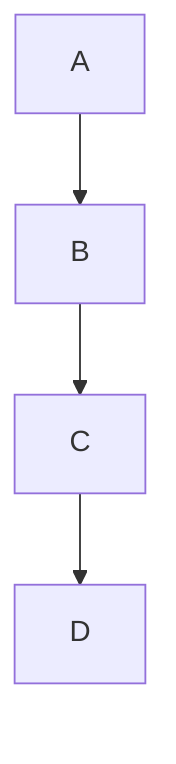

## 开始

这是我第一次尝试搭建一个属于自己的个人博客网站，在这之前，我完全不知道搭建一个网站需要做些什么，感谢 ChatGPT，我搭建博客的流程是在与他聊天中一步步摸索出来的，我所使用的各种各样的工具大多也都是他推荐的，感谢 [Astro](https://astro.build/) 和 [Retypeset](https://github.com/radishzzz/astro-theme-retypeset)，它们让我甚至不用知道 HTML、CSS、JS 是什么就可以拥有一个设计精美的个人网站。

Retypeset 的设计者非常贴心地为我们这些博客小白设计了上手指南以及 Markdown 文档语法指南。为了熟悉 md 语法，在以后写博客的过程中更加得心应手，我打算从这篇博客开始，先复现一下指南中实现的各种效果。

## Markdown 基本语法

### 标题与段落

这一部分的效果在博客中处处都有体现，故不再重复实现。

### 图片


我的大多数社交媒体上都用这个小恐龙作为自己的头像。我最早看见它是在高考前夕，我们学校每年都会举行让高一高二的同学为高三的同学一对一送礼物、加油打气的活动，我当时收到的就是印有这个小恐龙的一个吧唧。或许是因为当时心理压力比较大<del>（毕竟除了卷子没见过什么美好的东西）</del>，我一眼就喜欢上了这个小恐龙，再加上我本人比较喜欢简洁可爱的设计，于是就拿它来当头像了。

### 块引用

> gugugaga
> 
> 咕咕嘎嘎
>
> **咕咕嘎嘎**
>
> _咕咕嘎嘎_
>
> —— <cite>《MyGO》[^1]</cite>

[^1]: [MyGO](https://www.bilibili.com/bangumi/media/md23679123) 是一份组乐队指南

### 表格

|周一  |周二  |周三  |
|-----|-----|-----|
|`无课 `|` 无课 `|` 无课`|
|`逃课 `|` 耍起 `|` 耍起`|

### 代码块

```c
#include<stdio.h>

int main(){
  printf("Hello World\n");
  return 0;
}
```

### 列表

#### 有序列表

1. 打开冰箱
2. 把大象放进去
3. 关上冰箱

#### 无序列表

- 太阳
- 星星
- 月亮

#### 嵌套列表

- SZ
  - 000725
- SH
  - 513400
  - 563360

### 其他

H<sub>2</sub>O

X<sup>n</sup>

<abbr title="most valuable player">MVP</abbr>凯歌

按下<kbd>Alt</kbd>

<mark>高亮以表示强调</mark>

---

## Markdown 拓展功能

### 隐藏图注


### 提示块

> [!TIP]
> 喜欢我的小 TIP 吗

:::warning
未满 18 岁请在监护人陪同下进行观看
:::

### 折叠块

:::fold[一堆句号]
。

。。

。。。

。。。。

。。。。。

。。。。。。

。。。。。。。
:::

### Mermaid 图表



### 画廊

:::gallery


:::

### 一些奇妙的外部链接

我的 GitHub blog 仓库
::github{repo="L1thosphere/blog"}

2025 每周必看
::bilibili{id="BV1ewwxesEu4"}

## 结束

模板作者在 demo 中提到的现在大概就这么多，我觉得这已经足够我消化上好一阵子了。另外还有一些我想要的功能是现在的 blog 没有的，后续我会慢慢完善。今天就先到这里吧，希望我有动力继续把我的博客更下去。